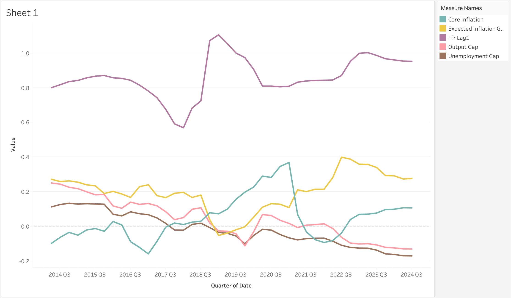

# Challenge Assignment

This program automates the full data preparation and analysis workflow for the economic indicators used in the project. It connects to the FRED database using an API key and downloads the required time series, including inflation, GDP, unemployment, interest rates, and expected inflation. The program then organizes the data into a consistent structure, converting monthly series into quarterly values so that all variables can be analyzed together.

After the data is aligned to the same quarterly frequency, the program merges the datasets into one combined file. Additional calculated fields are created, such as lagged interest rates and economic gaps, which are commonly used in macroeconomic analysis. These calculated variables help capture relationships between economic conditions and policy decisions.

Finally, the program performs a rolling regression analysis to estimate how the Federal Funds Rate responds to changes in inflation, output, and unemployment over time. The results are saved into several output files with shorter, simplified names so they are easier to identify and use in other software such as Excel, Tableau, or Python visualization tools.

Overall, the program streamlines what would normally be multiple manual steps into a single automated workflow, improving consistency, reducing errors, and saving time when updating or expanding the analysis.

## Regression Analysis

The regression analyzes how different economic variables influence the Federal Funds Rate (FFR) over time. One of the most important relationships shown in the graph is the strong effect of **FFR Lag 1**, which represents the previous period’s interest rate. The line for FFR Lag 1 remains relatively smooth and stable, suggesting that interest rates tend to change gradually rather than drastically from one quarter to the next. This indicates that past interest rates are a strong predictor of current interest rates, which is consistent with how central banks typically adjust monetary policy slowly to avoid sudden shocks to the economy.

The graph also shows that inflation measures, such as Core Inflation and the Expected Inflation Gap, increase notably between 2020 and 2023. During this same period, interest rates also rise, suggesting a positive relationship between inflation and interest rate decisions. This supports economic theory that when inflation rises, central banks often increase interest rates to reduce spending and stabilize prices. Additionally, the Output Gap and Unemployment Gap provide context about overall economic performance. The unemployment gap generally trends downward, indicating improving labour market conditions, which can contribute to inflation pressures and encourage higher interest rates.

Overall, the regression suggests that interest rate decisions are influenced by a combination of past interest rates, inflation levels, and general economic conditions. The data reveals that inflation appears to be one of the strongest drivers of changes in the Federal Funds Rate during this period, especially following the economic disruptions around 2020. The model reflects typical macroeconomic relationships, where policymakers adjust interest rates in response to inflation and labour market conditions in order to maintain economic stability.

## Recreated Graph

